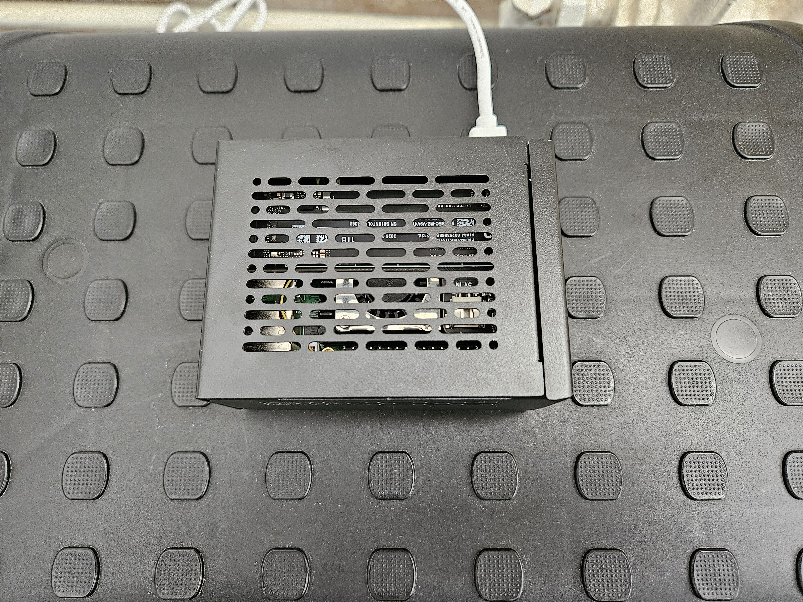

# Homelab — Raspberry Pi 5 sur SSD NVMe

Mon petit serveur maison : un Raspberry Pi 5 sous Ubuntu Server, qui démarre sur un SSD NVMe de 1 To.

## Objectif

- Héberger et déployer mes projets personnels
- M'entraîner à l'administration Linux
- Servir de sauvegarde pour pouvoir passer mon PC sous Ubuntu

## Matériel

| Composant | Modèle | Remarque |
|---|---|---|
| Carte | Raspberry Pi 5, 8 Go | |
| Carte PCIe vers M.2 | Geekworm X1001 | Se monte au-dessus du Pi, accepte les SSD 2230 à 2280 |
| SSD | Samsung 990, 1 To, NVMe M.2 2280 | |
| Refroidissement | Geekworm H505 (actif) | Listé compatible avec le X1001 par Geekworm |
| Boîtier | Geekworm P579-V2 (métal) | Boîtier prévu pour le X1001 |
| Alimentation | Officielle Raspberry Pi 27 W USB-C | |

## État actuel

- Ubuntu Server 26.04.1 LTS, installé et démarré directement sur le SSD
- Connexion en Wi-Fi, accès en SSH depuis mon PC, et depuis mon téléphone (Termux) en secours
- Shell zsh avec oh-my-zsh

## Ce que j'en retiens

- Le port PCIe du Pi 5 est désactivé par défaut : sans une ligne dans la configuration de démarrage, le SSD reste invisible.
- Le Wi-Fi a été le plus gros obstacle : près de la box, le Pi refusait de se connecter, même après plusieurs redémarrages. Il a fallu l'éloigner pour une première connexion en 2,4 GHz, après quoi le 5 GHz a fonctionné, pour une raison que les journaux n'ont pas permis d'expliquer.
- Toujours éteindre proprement : une coupure de courant juste après un téléchargement a suffi à corrompre l'image système.

## Documentation

- [Guide d'installation](docs/installation.md) : montage, installation pas à pas et configuration
- [Problèmes rencontrés et solutions](docs/problemes.md)

## Prochaines étapes

- Environnement Node.js (nvm, PM2 ou Docker)
- Environnement Java
- Déploiement automatique de mes projets depuis GitHub
- Accès à distance via un VPN
- Un projet de stockage de fichiers personnel, sur le modèle de Google Drive, hébergé sur le Pi, avec :
  - une application Android ;
  - une application web, utilisable directement dans le navigateur ;
  - une application de bureau sans Electron, trop gourmand en mémoire vive.
